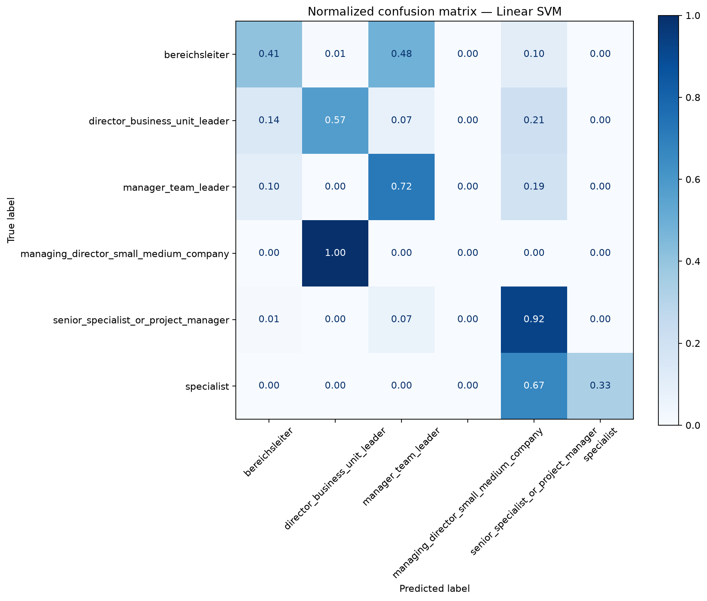

# Job Level Classification

Dự án Machine Learning phân loại **cấp bậc nghề nghiệp** từ nội dung tin tuyển dụng.

## Tôi đã làm được gì?

- Làm sạch và phân tích **8.052 tin tuyển dụng**.
- Xây dựng bài toán phân loại **6 cấp bậc nghề nghiệp**.
- Chuyển văn bản thành đặc trưng bằng TF-IDF.
- Mã hóa location và function bằng One-Hot Encoding.
- Xử lý dữ liệu mất cân bằng bằng class weighting.
- So sánh baseline, Logistic Regression và Linear SVM.
- Đóng gói preprocessing và model bằng scikit-learn Pipeline.
- Tạo giao diện Streamlit cho phép nhập dữ liệu và nhận dự đoán.
- Viết unit test cho xử lý dữ liệu, model và ứng dụng.

## Kết quả

| Model | Accuracy | Macro-F1 |
|---|---:|---:|
| Baseline | 53,69% | 11,65% |
| Logistic Regression | 77,16% | 52,86% |
| **Linear SVM** | **78,71%** | **54,06%** |

Macro-F1 được sử dụng vì dữ liệu mất cân bằng mạnh. Model cuối cải thiện macro-F1 từ **11,65% lên 54,06%** so với baseline.



## Input và output

Input gồm:

- tiêu đề công việc;
- địa điểm;
- mô tả công việc;
- nhóm chức năng;
- ngành nghề.

Output là một trong 6 cấp bậc, ví dụ: Specialist, Manager / Team Leader hoặc Director / Business Unit Leader.

## Công nghệ

Python, pandas, scikit-learn, TF-IDF, Linear SVM, Logistic Regression, Streamlit, joblib và pytest.

## Chạy ứng dụng

```bash
pip install -r requirements.txt
python -m streamlit run app.py
```

Huấn luyện lại model:

```bash
python -m src.train
```

Chạy test:

```bash
python -m pytest -q
```

## Hạn chế

Dữ liệu mất cân bằng rất mạnh và một số lớp có quá ít mẫu. Model phù hợp để trình bày quy trình ML, chưa nên sử dụng trực tiếp cho quyết định nhân sự.
